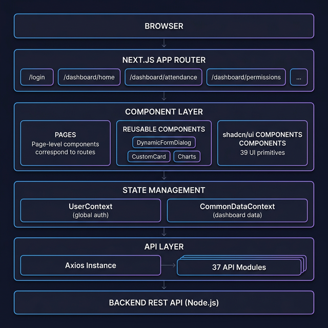
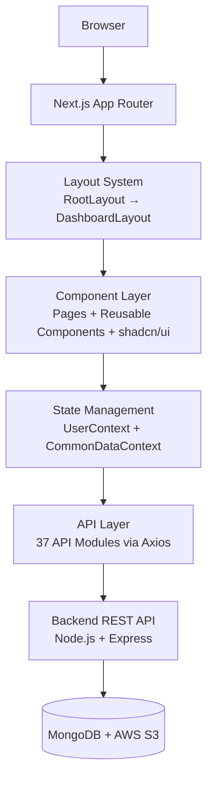
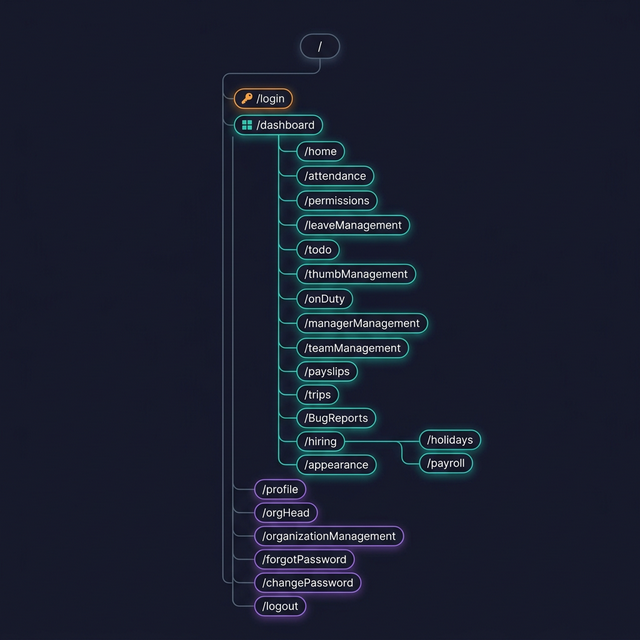
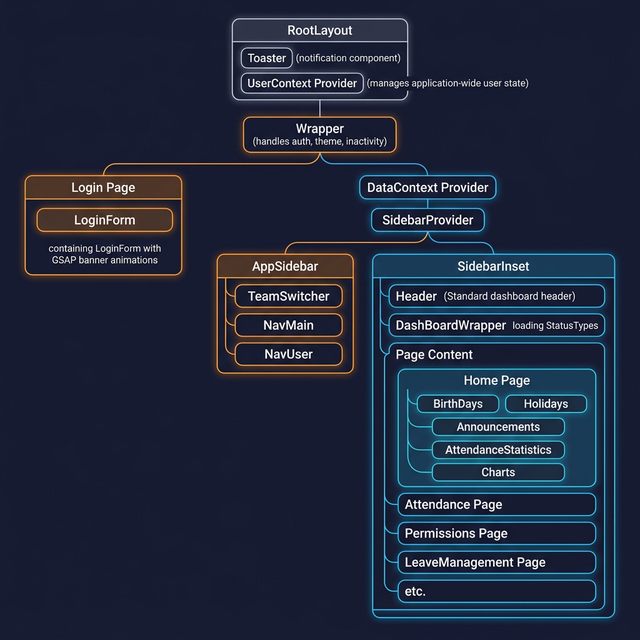
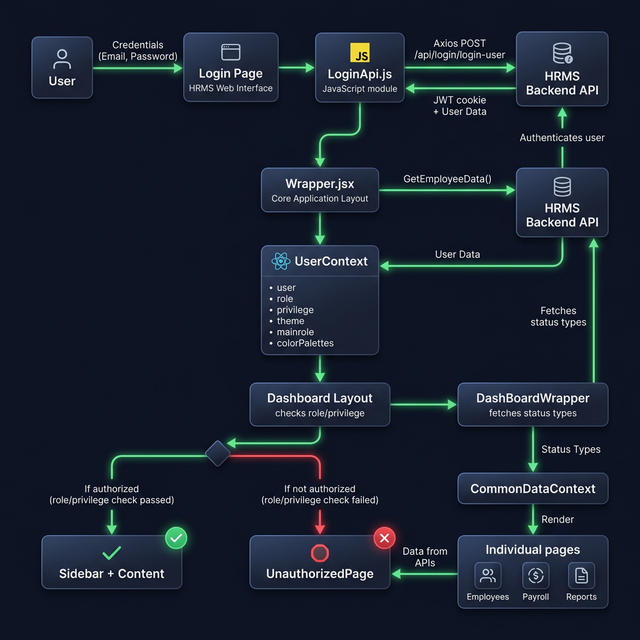
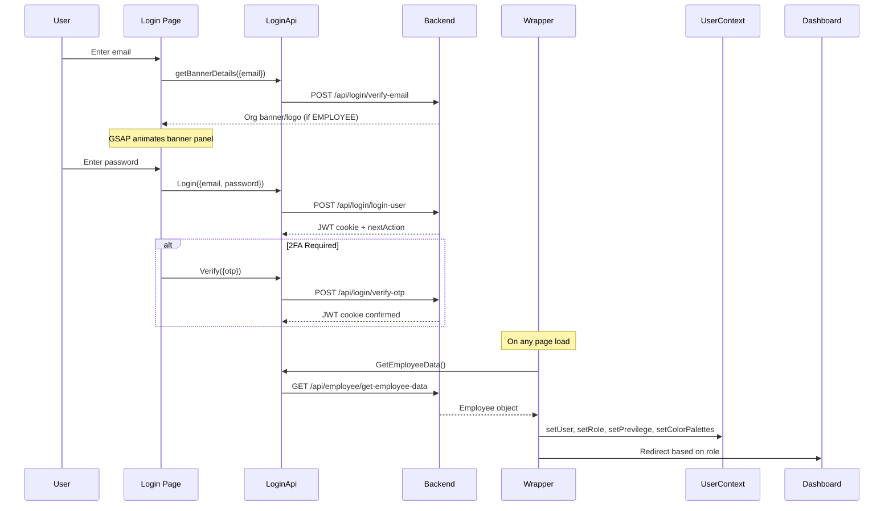
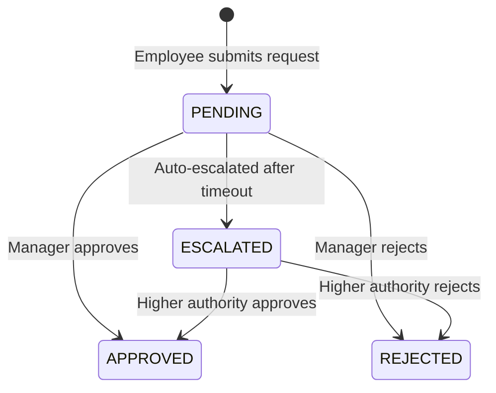

# 📘 HiBi HRMS Frontend — Architecture Documentation

> **Project:** HiBi — People Management Simplified  
> **Framework:** Next.js 14 (App Router)  
> **Language:** JavaScript (JSX)  
> **Generated:** March 10, 2026

---

## Table of Contents

1. [Project Overview](#1-project-overview)
2. [High-Level Architecture](#2-high-level-architecture)
3. [Technology Stack](#3-technology-stack)
4. [Directory Structure](#4-directory-structure)
5. [Routing Architecture](#5-routing-architecture)
6. [Component Hierarchy & Layout System](#6-component-hierarchy--layout-system)
7. [State Management](#7-state-management)
8. [API Layer](#8-api-layer)
9. [Authentication & Authorization Flow](#9-authentication--authorization-flow)
10. [UI Component Library](#10-ui-component-library)
11. [Reusable Components](#11-reusable-components)
12. [Theming & Styling](#12-theming--styling)
13. [Utilities & Helpers](#13-utilities--helpers)
14. [Feature Modules](#14-feature-modules)
15. [Security Considerations](#15-security-considerations)
16. [Configuration](#16-configuration)

---

## 1. Project Overview

**HiBi** is a comprehensive Human Resource Management System (HRMS) web application designed to simplify people management. The frontend is built as a modern single-page application using Next.js 14's App Router, providing a rich, interactive dashboard experience for managing employees, attendance, leaves, permissions, payroll, and more.

### Key Features

| Module | Description |
|---|---|
| **Home Dashboard** | Greeting, announcements, birthdays, holidays, attendance statistics, org-wide metrics |
| **Attendance Management** | Track employee check-in/check-out, attendance reports |
| **Leave Management** | Apply/approve/reject leave requests with action-required badges |
| **Permission Management** | Handle permission requests including WFH with escalation tracking |
| **To-Do Management** | Task tracking and management |
| **Thumb Management** | Biometric thumb-based request management |
| **On Duty Management** | Track on-duty and field assignments |
| **Employee/Manager Management** | CRUD operations for employee records |
| **Team Management** | Team creation, assignments, and hierarchy |
| **HR Management** (Admin) | Holidays, hiring pipeline, payroll configuration |
| **PaySlips** | View and download salary slips |
| **Trips** | Travel request and management |
| **Bug Reports** | Internal issue tracking |
| **Appearance Settings** | Org-level theme and color customization |
| **Profile & User Profile** | Personal profile management with DigiLocker integration |
| **Organization Management** | Multi-org management (Product Manager role) |

---

## 2. High-Level Architecture

The application follows a **layered architecture** pattern with clear separation of concerns:



### Architecture Layers



> **⚠️ Important:** The frontend is a fully **client-side rendered** application. Despite using Next.js App Router, all page components use the `"use client"` directive since they rely heavily on React hooks, context, and browser APIs.

---

## 3. Technology Stack

| Category | Technology | Version | Purpose |
|---|---|---|---|
| **Framework** | Next.js | 14.2.30 | App Router, file-based routing, font optimization |
| **UI Library** | React | ^18 | Component-based UI |
| **Styling** | Tailwind CSS | ^3.4.1 | Utility-first CSS framework |
| **UI Primitives** | Radix UI / shadcn | New York style | 39 accessible, unstyled UI primitives |
| **Animation** | Framer Motion | ^12.23.16 | Declarative animations |
| **Animation** | GSAP | ^3.13.0 | High-performance timeline animations (login page) |
| **Forms** | React Hook Form | ^7.62.0 | Performant form management |
| **Validation** | Zod | ^4.0.17 | Schema-based validation |
| **HTTP Client** | Axios | ^1.11.0 | API requests with interceptors |
| **Charts** | Recharts | ^2.15.4 | Dashboard charts and graphs |
| **Tables** | TanStack React Table | ^8.21.3 | Advanced data tables |
| **Icons** | Lucide React, React Icons, Tabler, Heroicons | Various | Icon libraries |
| **Date Handling** | date-fns, moment-timezone | Various | Date formatting and manipulation |
| **PDF Generation** | jsPDF + html2canvas | Various | Payslip/report PDF export |
| **Excel** | ExcelJS, xlsx | Various | Import/export spreadsheets |
| **Encryption** | CryptoJS | ^4.2.0 | Client-side AES encryption |
| **QR Code** | qrcode | ^1.5.4 | QR code generation |
| **Carousel** | Swiper | ^12.0.2 | Touch-enabled sliders |
| **Theme** | next-themes | ^0.4.6 | Dark/light mode management |
| **Analytics** | Matomo | Script | Open-source web analytics |

---

## 4. Directory Structure

```
HRMS_Frontend/
├── public/                          # Static assets
├── src/
│   ├── Apis/                        # 📡 37 API modules (centralized data layer)
│   │   ├── AccessControl.js
│   │   ├── Announcements_Apis.js
│   │   ├── AssetsApi.js
│   │   ├── Attendance_Apis.js
│   │   ├── AttendenceTypes.js
│   │   ├── BulkUpload.js
│   │   ├── CarrierHistory.js
│   │   ├── Common_APIs.js
│   │   ├── Employees.js
│   │   ├── Holidays_Apis.js
│   │   ├── HomePageApi.js
│   │   ├── LeaveManagement.js
│   │   ├── LoginApi.js              # Auth: login, logout, OTP, employee data
│   │   ├── Organization_Management.js
│   │   ├── Payroll_Apis.js
│   │   ├── Permissions_APIs.js      # Largest API module (12KB)
│   │   ├── Profile_Api.js
│   │   ├── StatisticsApis.js
│   │   ├── TeamManagementApi.js
│   │   ├── ToDoApis.js
│   │   ├── TripsApi.js
│   │   ├── WFHApis.js
│   │   ├── bugReportApi.js
│   │   ├── department_Api.js
│   │   ├── designation_Api.js
│   │   ├── digiloacker.js           # DigiLocker gov integration
│   │   ├── leaveType_Api.js
│   │   ├── odapi.js                 # On-Duty APIs
│   │   ├── password_Api.js
│   │   ├── paySlips.js
│   │   ├── permission_Api.js
│   │   ├── previlege_Api.js
│   │   ├── role_Api.js
│   │   ├── shifts_Api.js
│   │   ├── status_Api.js
│   │   ├── twofactor.js             # 2FA support
│   │   └── Thumb_Apis.js
│   │
│   ├── app/                         # 🏗️ Next.js App Router
│   │   ├── layout.js                # Root layout (UserContext, Toaster, Matomo)
│   │   ├── page.js                  # Root page (loading redirect)
│   │   ├── globals.css              # Global styles + CSS variables (light/dark)
│   │   ├── app-sidebar.jsx          # Main sidebar navigation component
│   │   ├── ColorPalettes.js         # Default org color palettes
│   │   ├── HrmsIcon.svg             # App icon
│   │   │
│   │   ├── context/                 # 🔐 Global context providers
│   │   │   └── UserContext.jsx      # Auth state: user, role, privilege, theme
│   │   │
│   │   ├── components/              # 🧩 App-level components
│   │   │   ├── Wrapper.jsx          # Auth guard, theme init, inactivity handler
│   │   │   ├── BgIcon.jsx
│   │   │   ├── ProfileDropdown.jsx
│   │   │   ├── Toggle.jsx           # Dark/light mode toggle
│   │   │   ├── ReusableComponents/  # 21 reusable building blocks
│   │   │   │   ├── DynamicFormDialog.jsx  # Config-driven form generator (1094 lines)
│   │   │   │   ├── CustomActionDialog.jsx
│   │   │   │   ├── CustomAlert.jsx
│   │   │   │   ├── CustomAvatar.jsx
│   │   │   │   ├── CustomCard.jsx
│   │   │   │   ├── CustomDialog.jsx
│   │   │   │   ├── BarChartComponent.jsx
│   │   │   │   ├── CountGraph.jsx
│   │   │   │   ├── EmployeePanel.jsx
│   │   │   │   ├── Loader.jsx
│   │   │   │   ├── PageHeader.jsx
│   │   │   │   ├── UnauthorizedPage.jsx
│   │   │   │   ├── UserCard.jsx
│   │   │   │   └── ... more
│   │   │   └── dashboard/           # Dashboard-specific components
│   │   │       ├── home/            # Home page widgets
│   │   │       ├── attendance/
│   │   │       ├── hiring/          # Dept, Designation, Employees, Leaves, etc.
│   │   │       ├── leavesManagement/
│   │   │       ├── managersManagement/
│   │   │       ├── todo/
│   │   │       ├── BugReports/
│   │   │       └── appearance/
│   │   │
│   │   ├── dashboard/               # 📊 Dashboard routes (protected)
│   │   │   ├── layout.js            # Dashboard layout with sidebar
│   │   │   ├── page.js              # Redirects to /dashboard/home
│   │   │   ├── DashBoardWrapper.jsx # Loads status types before rendering
│   │   │   ├── context/
│   │   │   │   └── CommonDataContext.jsx  # Shared dashboard state
│   │   │   ├── home/page.js
│   │   │   ├── attendance/page.jsx
│   │   │   ├── permissions/page.js
│   │   │   ├── leaveManagement/page.js
│   │   │   ├── todo/page.js
│   │   │   ├── thumbManagement/page.js
│   │   │   ├── onDuty/page.js
│   │   │   ├── managerManagement/page.jsx
│   │   │   ├── teamManagement/page.jsx
│   │   │   ├── payslips/page.jsx
│   │   │   ├── trips/page.jsx
│   │   │   ├── BugReports/page.jsx
│   │   │   ├── hiring/              # Nested admin routes
│   │   │   │   ├── page.js
│   │   │   │   ├── holidays/page.js
│   │   │   │   └── payroll/page.js
│   │   │   ├── onboarding/page.js
│   │   │   └── appearance/page.js
│   │   │
│   │   ├── login/page.js            # Login page with GSAP animations
│   │   ├── logout/page.js           # Logout handler
│   │   ├── forgotPassword/page.js
│   │   ├── changePassword/page.js
│   │   ├── profile/page.jsx
│   │   ├── userProfile/[id]/page.js # Dynamic user profile route
│   │   ├── orgHead/page.js          # Organization Head portal
│   │   ├── organizationManagement/page.js  # Product Manager portal
│   │   ├── External/page.jsx        # External/public page
│   │   └── Test/page.js             # Dev testing page
│   │
│   ├── components/                  # 🎨 shadcn/ui component library
│   │   ├── ui/                      # 39 UI primitives
│   │   │   ├── sidebar.jsx          # Complex sidebar (21KB)
│   │   │   ├── button.jsx
│   │   │   ├── dialog.jsx
│   │   │   ├── select.jsx
│   │   │   ├── table.jsx
│   │   │   ├── calendar.jsx
│   │   │   ├── chart.jsx
│   │   │   ├── toast.jsx
│   │   │   ├── form.jsx
│   │   │   ├── timeline.jsx
│   │   │   └── ... 29 more
│   │   ├── login-form.jsx
│   │   ├── nav-main.jsx             # Main navigation items
│   │   ├── nav-user.jsx             # User profile in sidebar footer
│   │   ├── team-switcher.jsx        # Role/team switching
│   │   └── ... more layout components
│   │
│   ├── config/                      # ⚙️ Configuration
│   │   └── axiosConfig.js           # Centralized Axios instance
│   │
│   ├── hooks/                       # 🪝 Custom React hooks
│   │   ├── use-mobile.jsx           # Mobile breakpoint detection
│   │   ├── use-toast.js             # Toast notification hook
│   │   └── useDownload.js           # File download utility hook
│   │
│   ├── lib/                         # 📚 Shared libraries
│   │   ├── utils.js                 # cn() — Tailwind class merging
│   │   └── ToastService.jsx         # Global toast service (singleton)
│   │
│   └── utils/                       # 🔧 Utility functions
│       ├── DateFunctions.js         # 15+ date formatting functions
│       ├── UseFulFunctions.js       # Image cropping, pending count calc
│       ├── Validations.js           # Form validation rules
│       ├── CommonFunctionality.js   # String comparison helpers
│       ├── CustomColorPalettes.js   # Color palette management
│       ├── FilterStatusTypes.js     # Status type filtering
│       ├── PermissionsIcons.js      # Permission type icon mapping
│       ├── ProcessRequestsConfig.js # Request processing config
│       └── crypto.js                # AES encryption/decryption
│
├── docs/                            # 📖 Documentation assets
│   └── images/                      # Architecture diagrams
│
├── components.json                  # shadcn/ui configuration
├── tailwind.config.js               # Tailwind + custom design tokens
├── next.config.mjs                  # Next.js config (AWS S3 images)
├── postcss.config.mjs               # PostCSS configuration
├── DOCUMENTATION.md                 # ← You are here
└── package.json                     # Dependencies & scripts
```

---

## 5. Routing Architecture

The application uses Next.js 14's **file-based App Router**. Every folder inside `src/app/` with a `page.js` or `page.jsx` file becomes a route.



### Complete Route Map

| Route | File | Access Level | Description |
|---|---|---|---|
| `/` | `app/page.js` | Public | Loading screen → auto-redirects based on role |
| `/login` | `app/login/page.js` | Public | Login with GSAP animated banner |
| `/forgotPassword` | `app/forgotPassword/page.js` | Public | Password recovery |
| `/changePassword` | `app/changePassword/page.js` | Authenticated | Change password |
| `/logout` | `app/logout/page.js` | Authenticated | Session cleanup & redirect |
| `/External` | `app/External/page.jsx` | Public | External-facing page |
| `/profile` | `app/profile/page.jsx` | Authenticated | Own profile management |
| `/userProfile/[id]` | `app/userProfile/[id]/page.js` | Authenticated | View any user's profile (dynamic) |
| `/orgHead` | `app/orgHead/page.js` | ORGANIZATION HEAD | Org head portal |
| `/organizationManagement` | `app/organizationManagement/page.js` | PRODUCT MANAGER | Multi-org management |
| `/dashboard` | `app/dashboard/page.js` | Authorized roles | Redirects to `/dashboard/home` |
| `/dashboard/home` | `app/dashboard/home/page.js` | Authorized roles | Main dashboard |
| `/dashboard/attendance` | `app/dashboard/attendance/page.jsx` | Authorized roles | Attendance tracking |
| `/dashboard/permissions` | `app/dashboard/permissions/page.js` | Authorized roles | Permission requests |
| `/dashboard/leaveManagement` | `app/dashboard/leaveManagement/page.js` | Authorized roles | Leave applications |
| `/dashboard/todo` | `app/dashboard/todo/page.js` | Authorized roles | Task management |
| `/dashboard/thumbManagement` | `app/dashboard/thumbManagement/page.js` | Authorized roles | Biometric requests |
| `/dashboard/onDuty` | `app/dashboard/onDuty/page.js` | Authorized roles | On-duty tracking |
| `/dashboard/managerManagement` | `app/dashboard/managerManagement/page.jsx` | Authorized roles | Employee management |
| `/dashboard/teamManagement` | `app/dashboard/teamManagement/page.jsx` | Authorized roles | Team management |
| `/dashboard/payslips` | `app/dashboard/payslips/page.jsx` | Authorized roles | Salary slips |
| `/dashboard/trips` | `app/dashboard/trips/page.jsx` | Authorized roles | Trip management |
| `/dashboard/BugReports` | `app/dashboard/BugReports/page.jsx` | Authorized roles | Bug reporting |
| `/dashboard/onboarding` | `app/dashboard/onboarding/page.js` | Authorized roles | Employee onboarding |
| `/dashboard/hiring` | `app/dashboard/hiring/page.js` | SUPERADMIN | HR admin panel |
| `/dashboard/hiring/holidays` | `app/dashboard/hiring/holidays/page.js` | SUPERADMIN | Holiday management |
| `/dashboard/hiring/payroll` | `app/dashboard/hiring/payroll/page.js` | SUPERADMIN / ACCOUNTANT | Payroll config |
| `/dashboard/appearance` | `app/dashboard/appearance/page.js` | SUPERADMIN / DESIGNER | Theme customization |

### Role-Based Route Redirects

```mermaid
graph TD
    A[User Visits /] --> B{Authenticated?}
    B -->|No| C[Redirect to /login]
    B -->|Yes| D{Check Role}
    D -->|ORGANIZATION HEAD| E[/orgHead]
    D -->|PRODUCT MANAGER| F[/organizationManagement]
    D -->|EMPLOYEE / ADMIN / etc.| G[/dashboard/home]
```

---

## 6. Component Hierarchy & Layout System

The application uses **nested layouts** — a core feature of the Next.js App Router. Each layout wraps its child routes, creating a hierarchical component tree.



### Layout Nesting (Top to Bottom)

```
RootLayout (app/layout.js)
├── <Toaster />                        ← Global toast notifications
├── <UserContext>                      ← Global auth state provider
│   └── <Wrapper>                      ← Auth guard + theme init + inactivity
│       │
│       ├── [Login Page]               ← /login (no sidebar)
│       ├── [Forgot Password]          ← /forgotPassword (no sidebar)
│       ├── [Profile]                  ← /profile (no sidebar)
│       │
│       └── Dashboard Layout (dashboard/layout.js)
│           ├── Role/Privilege Check   ← Unauthorized → <UnauthorizedPage />
│           └── <DataContext>          ← Dashboard-scoped shared state
│               └── <SidebarProvider>
│                   ├── <AppSidebar>
│                   │   ├── <TeamSwitcher>     ← Role switching
│                   │   ├── <NavMain>          ← Navigation items with badges
│                   │   └── <NavUser>          ← User avatar + dropdown
│                   └── <SidebarInset>
│                       ├── <header>
│                       │   └── <SidebarTrigger>  ← Collapse/expand sidebar
│                       └── <DashBoardWrapper>    ← Loads status types
│                           └── {children}         ← Actual page content
```

### Key Layout Components

#### RootLayout — `app/layout.js`
- Renders `<html>` and `<body>` tags
- Injects **Matomo Analytics** script (afterInteractive strategy)
- Wraps everything in `<UserContext>` → `<Wrapper>`
- Includes global `<Toaster>` for toast notifications

#### Wrapper — `app/components/Wrapper.jsx`
This is the **most critical component** in the app. It:
1. **Authenticates** — calls `LoginApi.GetEmployeeData()` on mount
2. **Sets global state** — populates `UserContext` with user data, role, privilege
3. **Handles redirects** — routes users based on their role
4. **Initializes theme** — reads from `localStorage` and applies dark/light class
5. **Renders theme toggle** — fixed bottom-right `<ToggleComponent>`
6. **Shows loading state** — displays loading screen until auth check completes
7. **Inactivity handling** — (currently disabled) auto-logout after idle timeout

#### Dashboard Layout — `dashboard/layout.js`
- Checks `role` and `privilege` — blocks unauthorized access
- Wraps content in `<DataContext>` for shared dashboard state
- Sets up sidebar with `<SidebarProvider>` + `<AppSidebar>`
- Renders header with collapsible sidebar trigger

#### DashBoardWrapper — `dashboard/DashBoardWrapper.jsx`
- Pre-fetches `statusTypes` from the API before rendering child content
- Shows `<CustomLoader>` during data fetch
- Stores status types in `CommonDataContext`

---

## 7. State Management

The application uses **React Context API** for state management — no external state libraries (Redux, Zustand, etc.). State is split into two context providers:

### 7.1 UserContext (Global)

**File:** `src/app/context/UserContext.jsx`  
**Scope:** Entire application (wraps all routes)

| State | Type | Description |
|---|---|---|
| `user` | Object \| null | Full employee object from backend (name, email, roleId, orgId, etc.) |
| `role` | String \| null | Current active role: `EMPLOYEE`, `INTERN`, `ACCOUNTANT`, `DESIGNER`, `PRODUCTMANAGER`, `ORGANIZATIONHEAD`, or higher |
| `previlege` | String \| null | Privilege level: `SUPERADMIN`, `ADMIN`, `SUBADMIN`, or lower |
| `theme` | String \| null | Current theme preference |
| `mainrole` | String \| null | Original role (doesn't change when switching roles) |
| `colorPalettesFromBackend` | Object | Organization-specific color palettes for graphs and branding |

> **📝 Note:** The `role` can be switched at runtime through the `TeamSwitcher` component. Managers/Admins can switch between their role and `EMPLOYEE` to see the employee view. The `mainrole` preserves the original role.

### 7.2 CommonDataContext (Dashboard-Scoped)

**File:** `src/app/dashboard/context/CommonDataContext.jsx`  
**Scope:** Only dashboard routes (inside `/dashboard/*`)

| State | Type | Description |
|---|---|---|
| `statusTypes` | Array \| null | All status types (PENDING, APPROVED, REJECTED, etc.) for request processing |
| `reqCounts` | Object | Action-required counts for sidebar badges: `{ permissions, leaves, ods, thumb }` |

### 7.3 Toast Service (Singleton)

**File:** `src/lib/ToastService.jsx`

The toast system uses a **singleton pattern** — `setToast()` is called once by `Wrapper` to register the toast function, and `showToast()` can be called from **anywhere** (including non-component API files) to display notifications:

```javascript
// In Wrapper.jsx — register once
setToast(toast);

// In any API module — call globally
showToast("Employee created successfully", "success");
showToast("Failed to update", "error");
```

---

## 8. API Layer

### 8.1 Axios Configuration

**File:** `src/config/axiosConfig.js`

```javascript
const axiosInstance = axios.create({
  baseURL: process.env.NEXT_PUBLIC_BACKEND_BASE_URI,
  withCredentials: true,  // Sends cookies (JWT) with every request
});
```

- Base URL is loaded from environment variable `NEXT_PUBLIC_BACKEND_BASE_URI`
- `withCredentials: true` enables **cookie-based authentication** (HTTP-only JWT cookies)
- Response interceptors for global error handling are defined but currently **commented out**

### 8.2 API Module Pattern

All 37 API modules follow a **consistent pattern**:

```javascript
// Example: LoginApi.js
import axiosInstance from "@/config/axiosConfig";

async function Login(data) {
  try {
    const response = await axiosInstance.post("/api/login/login-user", data);
    if (response.status) {
      return {
        success: true,
        data: response.data,
        message: response.data?.message || "Success",
        status: response?.status
      };
    }
    return { success: false, data: response.data };
  } catch (error) {
    return {
      success: false,
      error: error.response?.data?.message || error.message || 'Unexpected error',
      status: error.response?.status,
      details: error.response?.data?.details || {}
    };
  }
}

const LoginApi = { Login, GetEmployeeData, Logout, Verify, getBannerDetails };
export default LoginApi;
```

> **💡 Tip:** Every API function returns a **normalized response object** with `{ success, data, error, status, details }`, making error handling consistent across all consumers.

### 8.3 Complete API Module Map

| Module | Key Endpoints | Size |
|---|---|---|
| `LoginApi.js` | Login, OTP verify, logout, get employee data, verify email/banner | 4.8 KB |
| `Permissions_APIs.js` | CRUD permissions, action-required, escalate, bulk operations | **12.2 KB** |
| `Profile_Api.js` | Profile CRUD, documents, DigiLocker, profile picture | 10.4 KB |
| `TeamManagementApi.js` | Teams CRUD, member management, hierarchy | 10.9 KB |
| `WFHApis.js` | Work-from-home requests, action required, approval flow | 9.4 KB |
| `LeaveManagement.js` | Leave apply/approve/reject, action required, balance | 9.7 KB |
| `Organization_Management.js` | Org CRUD, settings, branding | 8.8 KB |
| `Common_APIs.js` | Shared utility endpoints | 7.8 KB |
| `Attendance_Apis.js` | Check-in/out, reports, monthly data | 7.4 KB |
| `password_Api.js` | Password change, reset, forgot password | 6.7 KB |
| `ToDoApis.js` | Tasks CRUD, assign, complete | 6.1 KB |
| `Holidays_Apis.js` | Holidays CRUD, upcoming, past | 4.6 KB |
| `Announcements_Apis.js` | Announcements CRUD | 4.5 KB |
| `Thumb_Apis.js` | Thumb requests, action required | 5.0 KB |
| `department_Api.js` | Department CRUD | 4.1 KB |
| `designation_Api.js` | Designation CRUD | 4.2 KB |
| `shifts_Api.js` | Shift CRUD | 4.2 KB |
| `status_Api.js` | Status types | 4.1 KB |
| `leaveType_Api.js` | Leave type CRUD | 3.9 KB |
| `role_Api.js` | Role CRUD | 4.0 KB |
| `previlege_Api.js` | Privilege CRUD | 4.2 KB |
| `odapi.js` | On-Duty requests | 4.1 KB |
| `permission_Api.js` | Permission type CRUD | 3.1 KB |
| `digiloacker.js` | DigiLocker OAuth integration | 3.9 KB |
| `Employees.js` | Employee CRUD | 3.7 KB |
| `CarrierHistory.js` | Career/employment history | 3.0 KB |
| `TripsApi.js` | Trip CRUD | 3.6 KB |
| `BulkUpload.js` | Bulk employee upload | 2.7 KB |
| `bugReportApi.js` | Bug report CRUD | 2.7 KB |
| `Payroll_Apis.js` | Payroll configuration | 2.5 KB |
| `twofactor.js` | 2FA setup/verify | 2.0 KB |
| `StatisticsApis.js` | Dashboard statistics | 1.8 KB |
| `AccessControl.js` | Access control settings | 1.7 KB |
| `paySlips.js` | Payslip retrieval | 1.7 KB |
| `AttendenceTypes.js` | Attendance type config | 3.5 KB |
| `HomePageApi.js` | Home page data | 0.9 KB |
| `AssetsApi.js` | Asset management | 0.9 KB |

---

## 9. Authentication & Authorization Flow



### 9.1 Authentication Flow



### 9.2 Authorization Model

The app implements a **Role + Privilege** authorization model:

| Concept | Values | Purpose |
|---|---|---|
| **Role** | `EMPLOYEE`, `INTERN`, `ACCOUNTANT`, `DESIGNER`, `PRODUCTMANAGER`, `ORGANIZATIONHEAD`, and more | Defines the user's job function |
| **Privilege** | `SUPERADMIN`, `ADMIN`, `SUBADMIN`, others | Defines access level within a role |

**Authorization checks happen at three levels:**

1. **Wrapper Level** — Redirects unauthenticated users to `/login`
2. **Dashboard Layout** — Blocks `PRODUCTMANAGER`, `ORGANIZATIONHEAD`, and users without role/privilege
3. **Component Level** — Conditional rendering based on privilege:

```javascript
// Sidebar: Admin-only navigation items
if (previlege === "SUPERADMIN") {
  items.push({ title: "HR Management", url: "/dashboard/hiring", ... });
}

// Home page: Admin-only widgets
{Comparing.compareStrings(previlege, "SUPERADMIN") && <OrganizationAttendence />}
```

### 9.3 Role Switching

Users with higher roles (managers, admins) can **switch between roles** using the `TeamSwitcher` component:
- A manager can switch to `EMPLOYEE` to see the employee perspective
- Interns, Employees, Accountants, and Designers cannot switch — they only see their own role
- The `mainrole` state preserves the original role

---

## 10. UI Component Library

The project uses **shadcn/ui** (New York style) — a collection of accessible, customizable Radix UI primitives styled with Tailwind CSS. These are installed in `src/components/ui/`.

### All 39 UI Primitives

| Component | File | Description |
|---|---|---|
| **Sidebar** | `sidebar.jsx` | Complex collapsible sidebar with rail, sections, sub-menus |
| **Chart** | `chart.jsx` | Recharts wrapper with theme-aware colors |
| **Calendar** | `calendar.jsx` | Date picker (react-day-picker) |
| **Dropdown Menu** | `dropdown-menu.jsx` | Multi-level dropdown menus |
| **Button** | `button.jsx` | Multiple variants: default, destructive, outline, secondary, ghost, link |
| **Dialog** | `dialog.jsx` | Modal dialogs |
| **Select** | `select.jsx` | Custom styled select dropdowns |
| **Toast** | `toast.jsx` | Toast notification system |
| **Timeline** | `timeline.jsx` | Vertical timeline component |
| **Sheet** | `sheet.jsx` | Slide-out panel |
| **Table** | `table.jsx` | Styled table primitives |
| **Form** | `form.jsx` | Form context + field wrappers |
| **Tabs** | `tabs.jsx` | Tab navigation |
| **Command** | `command.jsx` | Command palette / search |
| **Alert Dialog** | `alert-dialog.jsx` | Confirmation dialogs |
| **Accordion** | `accordion.jsx` | Collapsible sections |
| **Popover** | `popover.jsx` | Floating content panels |
| **Tooltip** | `tooltip.jsx` | Hover tooltips |
| **Input** | `input.jsx` | Styled input fields |
| **Textarea** | `textarea.jsx` | Multi-line text input |
| **Badge** | `badge.jsx` | Status/label badges |
| **Card** | `card.jsx` | Content card with header, content, footer |
| **Avatar** | `avatar.jsx` | User avatars with fallback |
| **Checkbox** | `checkbox.jsx` | Checkbox with Radix |
| **Switch** | `switch.jsx` | Toggle switches |
| **Label** | `label.jsx` | Form labels |
| **Separator** | `separator.jsx` | Visual dividers |
| **Progress** | `progress.jsx` | Progress bars |
| **Skeleton** | `skeleton.jsx` | Loading skeletons |
| **Toggle** | `toggle.jsx` | Toggle buttons |
| **Collapsible** | `collapsible.jsx` | Collapsible containers |
| **Scroll Area** | `scroll-area.jsx` | Custom scrollbar areas |
| **Breadcrumb** | `breadcrumb.jsx` | Breadcrumb navigation |
| **Alert** | `alert.jsx` | Alert banners |
| **Drawer** | `drawer.jsx` | Mobile drawer using `vaul` |
| **Input OTP** | `input-otp.jsx` | OTP digit input |
| **Approval** | `Approval.jsx` | Custom approval status component |
| **ProcessRequestIcon** | `ProcessRequestIcon.jsx` | Request status icon mapping |
| **Toaster** | `toaster.jsx` | Toast container |

---

## 11. Reusable Components

Located in `src/app/components/ReusableComponents/`, these are **higher-level building blocks** used across multiple feature modules.

### 11.1 DynamicFormDialog (Core Component)

**File:** `src/app/components/ReusableComponents/DynamicFormDialog.jsx` — **1,094 lines**

This is the application's **most complex reusable component**. It generates complete forms from a JSON configuration object, supporting:

| Field Type | Description |
|---|---|
| `text` | Standard text input with validation |
| `number` / `tel` | Numeric input with keyboard restrictions |
| `email` | Email with cross-field validation (office vs personal) |
| `time` | 24-hour time picker |
| `calendar` | Single date picker with date range restrictions |
| `multicalendar` | Date range picker (from → to) |
| `multitext` | Dynamic list of text values (add/remove chips) |
| `select` | Dropdown select from options array |
| `multiselect` | Checkbox-based multi-select with search, select-all, chip preview |
| `textarea` | Multi-line text area |
| `file` | File upload (auto-switches to FormData) |
| `checkbox` | Boolean checkbox |

**Key features:**
- Auto-detects file fields and switches between **JSON** and **FormData** payloads
- Built-in validation with React Hook Form
- Supports `ExtraValues` — hidden fields appended to form data
- Calendar date restrictions (`showFrom`, `showTo`, `hideUpcoming`)
- `takeFullWidth` option for spanning full grid width
- Proper cleanup on dialog close (files, errors, state)

**Usage pattern:**

```jsx
<DynamicFormDialogComponent config={{
  title: "Add Employee",
  buttonText: "Add Employee",
  Fields: [
    { name: "firstName", label: "First Name", type: "text", required: true, validate: ValidateFirstName },
    { name: "email", label: "Email", type: "email", required: true },
    { name: "department", label: "Department", type: "select", array: departments, required: true },
    { name: "dob", label: "Date of Birth", type: "calendar", hideUpcoming: true, required: true },
    { name: "profilePic", label: "Profile Picture", type: "file" },
  ],
  ExtraValues: { orgId: "abc123" },
  onSubmit: async (payload) => await EmployeesApi.createEmployee(payload),
}} />
```

### 11.2 Other Reusable Components

| Component | Purpose |
|---|---|
| **CustomActionDialog** | Confirmation dialogs with approve/reject/custom actions |
| **CustomAlert** | Styled alert banners |
| **CustomAvatar** | User avatar with image or initials fallback |
| **CustomCard** | Styled content cards |
| **CustomDialog** | Simple dialog wrapper |
| **CustomDialogWithOpenControl** | Dialog with external open/close control |
| **CustomImageDialog** | Full-screen image preview dialog |
| **BarChartComponent** | Recharts bar chart with theme-aware colors |
| **CountGraph** | Animated circular count/progress visualization |
| **EmployeePanel** | Employee info panel with avatar and details |
| **Loader** | Centered loading spinner |
| **MultipleDateSelector** | Date range picker with presets |
| **SingleDateSelector** | Single date picker |
| **PageHeader** | Page title + action button header |
| **UnauthorizedPage** | "Access Denied" error page |
| **UserCard** | Employee card with avatar, name, role |
| **DeleteButton** | Styled delete action button |
| **DynamicIslandToast** | Apple-style Dynamic Island toast |

---

## 12. Theming & Styling

### 12.1 Design Token System

The app uses **CSS custom properties** defined in `src/app/globals.css` with HSL values, consumed by Tailwind via `tailwind.config.js`:

```css
:root {
  --background: 0 0% 100%;        /* White */
  --foreground: 0 0% 3.9%;        /* Near-black */
  --card: 0 0% 96%;               /* Light gray */
  --primary: 0 0% 9%;             /* Dark */
  --destructive: 0 84.2% 60.2%;   /* Red */
  --radius: 0.5rem;
  --sidebar-background: 0 0% 98%;
  /* ... 25+ design tokens */
}

.dark {
  --background: 0 0% 3.9%;        /* Near-black */
  --foreground: 0 0% 98%;         /* Near-white */
  --card: 240 0% 10%;             /* Dark gray */
  /* ... matching dark variants */
}
```

### 12.2 Dark Mode Implementation

Dark mode is implemented using:
- **Tailwind's `class` strategy** (`darkMode: ["class"]`)
- Manual class toggle via `localStorage` → `document.documentElement.classList`
- A fixed `<ToggleComponent>` in the bottom-right corner of every page

```javascript
// In Wrapper.jsx
const theme = localStorage.getItem("theme");
if (theme === "dark") {
  document.documentElement.classList.add("dark");
}
```

### 12.3 Typography

Two custom fonts loaded via `@font-face`:
- **DM Sans** — Primary font (applied globally via `*` selector)
- **Aspekta** — Secondary/accent font (available via `font-family: "aspekta"`)

### 12.4 Organization Color Palettes

Each organization can define custom color palettes stored in the backend. The defaults are:

```javascript
export const defaultColorPalettes = {
  graphBg: "#267C57",           // Green — graph background
  graphPresent: "#267C57",      // Green — present days
  graphAbsent: "#F43F5E",       // Red — absent days
  graphLeave: "#F6A823",        // Amber — leave days
  graphPermission: "#3B82F6",   // Blue — permissions
  graphWFH: "#A855F7",          // Purple — work from home
  todayBirthdayColor: "#22C55E",// Green — birthday highlights
  todayHolidayColor: "#9333EA", // Purple — holiday highlights
}
```

The `colorPalettesFromBackend` state in `UserContext` holds the org-specific overrides.

### 12.5 Custom Scrollbars

Minimal scrollbars globally applied:
- **3px wide** vertical scrollbar
- **6px tall** horizontal scrollbar
- Semi-transparent thumb with hover darkening

---

## 13. Utilities & Helpers

### 13.1 Date Functions (`utils/DateFunctions.js`)

**15+ utility functions** for date formatting across the application:

| Function | Returns | Example |
|---|---|---|
| `getDDMMYYDate(date)` | `"2024-03-10"` | ISO date string |
| `getToday_ddmmyy()` | `"2026-03-10"` | Today's date |
| `getFirstOfMonth_ddmmyy()` | `"2026-03-01"` | First day of current month |
| `getEndOfMonth_ddmmyy()` | `"2026-03-31"` | Last day of current month |
| `getFirstOfYear_ddmmyy()` | `"2026-01-01"` | First day of current year |
| `getEndOfYear_ddmmyy()` | `"2026-12-31"` | Last day of current year |
| `getNextMonthEnd_ddmmyy()` | `"2026-04-30"` | Last day of next month |
| `formatDate(dateStr)` | `"Mar 10, 2026"` | Human-readable date |
| `formatDateAndTime(dateStr)` | `"Mar 10, 2026 14:30:00"` | Date + time |
| `formatDateRange(start, end)` | `"Nov 19 - Nov 21"` | Compact range |
| `isTodayInRange(start, end)` | `true/false` | Year-agnostic range check |
| `daysToGo(targetDate)` | `5` | Days remaining |
| `getEventDescription(start, end)` | `"Nov 12 • 3 days to go"` | Event label |
| `formdataToJSON(formdata)` | `{}` | FormData → plain object |
| `toLocalISOString(date, time)` | `"2026-03-10T14:30:00.000Z"` | Local DateTime ISO |
| `calculateTotalDays(start, end)` | `3` | Count days in range |

### 13.2 Validation Functions (`utils/Validations.js`)

Pre-built validators for form fields:

| Validator | Rules |
|---|---|
| `ValidateEmployeeCode` | 4-10 alphanumeric characters |
| `ValidateFirstName` | Capital start, letters/spaces only, 2-50 chars |
| `ValidateLastName` | Same as first name (optional) |
| `ValidatePhone` | Starts with 6+, exactly 10 digits |
| `ValidateSalary` | Positive number, up to 2 decimal places |
| `ValidateDOB` | Age between 18 and 65 |
| `ValidateDOJ` | Cannot be in the future |
| `ValidateGender` | Required — MALE, FEMALE, PREFER NOT TO SAY |
| `ValidateProfilePicture` | Only .webp/.svg, max 2MB |
| `ValidateRole` | Required |
| `ValidatePrivileges` | Required |

### 13.3 Other Utilities

| File | Purpose |
|---|---|
| `CommonFunctionality.js` | Case-insensitive string comparison (`Comparing.compareStrings()`) |
| `UseFulFunctions.js` | `calculatePendingAndEscalated()` — count PENDING/ESCALATED items; `cropImageTo16x9()` / `cropImageTo16x5()` — client-side image cropping |
| `CustomColorPalettes.js` | Color palette management |
| `FilterStatusTypes.js` | Filter status type arrays |
| `PermissionsIcons.js` | Map permission types to icons |
| `ProcessRequestsConfig.js` | Request processing configuration |
| `crypto.js` | AES encrypt/decrypt using CryptoJS |

### 13.4 Custom Hooks

| Hook | File | Purpose |
|---|---|---|
| `useMobile()` | `hooks/use-mobile.jsx` | Returns `true` if viewport width < breakpoint |
| `useToast()` | `hooks/use-toast.js` | Toast notification hook with queue management |
| `useDownload()` | `hooks/useDownload.js` | File download utility with loading state |

---

## 14. Feature Modules

### 14.1 Login Module

**Route:** `/login`  
**Key Files:** `app/login/page.js`, `app/login/loginForm.jsx`

Features:
- **Two-panel layout** — Login form (right) + Organization banner (left)
- **GSAP animations** — Smooth panel width transitions when email is verified
- **Email-first flow** — Enter email → verify → show org banner → enter password
- **OTP verification** — Supports 2FA via OTP
- **Responsive** — Full-width login on mobile, split panels on desktop (1024px+)

### 14.2 Home Dashboard

**Route:** `/dashboard/home`  
**Key File:** `app/dashboard/home/page.js`

Widgets (role-dependent):
- **Greeting** — Time-based greeting with user name
- **Announcements** — Org-wide announcements (admins can create)
- **Organization Attendance** — (SUPERADMIN) Org-wide attendance overview
- **Holidays Card** — Upcoming holidays
- **Birthdays Card** — Employee birthdays
- **Attendance Statistics** — (ADMIN+) Attendance charts
- **Top Tables** — (SUPERADMIN) Top attendance, top leaves, top task completers
- **DigiLocker** — OAuth callback handler for government verification

### 14.3 Sidebar Navigation

**File:** `app/app-sidebar.jsx`

Features:
- **Dynamic menu** — Items change based on `role` and `privilege`
- **Action-required badges** — Shows counts for pending permissions, leaves, ODs, thumbs
- **Collapsible** — Full sidebar ↔ icon-only mode
- **Nested menus** — HR Management expands to Holidays, Hiring, Payroll
- **Mobile responsive** — Detects viewport < 700px
- **Role-colored icons** — Each nav item has a distinct accent color

### 14.4 Request Management Pattern

Multiple modules (Permissions, Leaves, On-Duty, Thumb, WFH) follow the same **request lifecycle pattern**:



The sidebar shows **badge counts** for PENDING + ESCALATED requests that require action.

---

## 15. Security Considerations

| Area | Implementation |
|---|---|
| **Authentication** | Cookie-based JWT with `httpOnly` flag (set by backend) |
| **Credential Transport** | `withCredentials: true` on all Axios requests |
| **Password Fields** | Browser auto-fill/reveal buttons hidden via CSS |
| **Client Encryption** | AES encryption via CryptoJS for sensitive data |
| **Route Protection** | Wrapper redirects unauthenticated users; Dashboard layout blocks unauthorized roles |
| **Inactivity Timeout** | Implemented but currently disabled — auto-logout after 5 min idle |
| **2FA Support** | OTP verification during login |
| **Input Validation** | Comprehensive client-side validation (employee code, phone, email, salary, etc.) |
| **Image Validation** | File type (.webp, .svg only) + size limit (2MB) |
| **Remote Images** | Whitelisted AWS S3 domain in `next.config.mjs` |

> **⚠️ Warning:** The `crypto.js` file contains a **hardcoded secret key** (`"my-secret-key"`). For production, this should be moved to an environment variable.

---

## 16. Configuration

### 16.1 Environment Variables

| Variable | Purpose |
|---|---|
| `NEXT_PUBLIC_BACKEND_BASE_URI` | Backend API base URL |

### 16.2 Next.js Config (`next.config.mjs`)

```javascript
const nextConfig = {
  images: {
    remotePatterns: [{
      protocol: 'https',
      hostname: "hrms-bucket-thub.s3.ap-south-1.amazonaws.com",
      pathname: '/**',
    }],
  },
};
```
- Allows Next.js `<Image>` component to load from AWS S3 bucket

### 16.3 shadcn/ui Config (`components.json`)

```json
{
  "style": "new-york",
  "rsc": true,
  "tsx": false,
  "tailwind": {
    "config": "tailwind.config.js",
    "css": "src/app/globals.css",
    "baseColor": "neutral",
    "cssVariables": true
  },
  "aliases": {
    "components": "@/components",
    "utils": "@/lib/utils",
    "ui": "@/components/ui",
    "lib": "@/lib",
    "hooks": "@/hooks"
  },
  "iconLibrary": "lucide"
}
```

### 16.4 Path Aliases (`jsconfig.json`)

The `@/` prefix maps to `src/`, enabling clean imports:

```javascript
import { Button } from "@/components/ui/button";
import LoginApi from "@/Apis/LoginApi";
import { cn } from "@/lib/utils";
```

### 16.5 Analytics (Matomo)

Matomo self-hosted analytics is injected in `RootLayout`:
- Tracker URL: `//analytics.devinco.dev/`
- Site ID: `1`
- Features: Page view tracking, link tracking

---

## Quick Reference

### NPM Scripts

| Script | Command | Purpose |
|---|---|---|
| `dev` | `next dev` | Start development server |
| `build` | `next build` | Production build |
| `start` | `next start` | Start production server |
| `lint` | `next lint` | Run ESLint |

### File Counts

| Category | Count |
|---|---|
| **Total source files** | 101+ |
| **Page routes** | 32 |
| **API modules** | 37 |
| **UI primitives (shadcn)** | 39 |
| **Reusable components** | 21 |
| **Utility files** | 9 |
| **Custom hooks** | 3 |
| **Context providers** | 2 |

---

> **📝 Note:** This documentation was generated by analyzing the complete source code of the HRMS Frontend project. For component-level API documentation, refer to the JSDoc comments within individual files.
